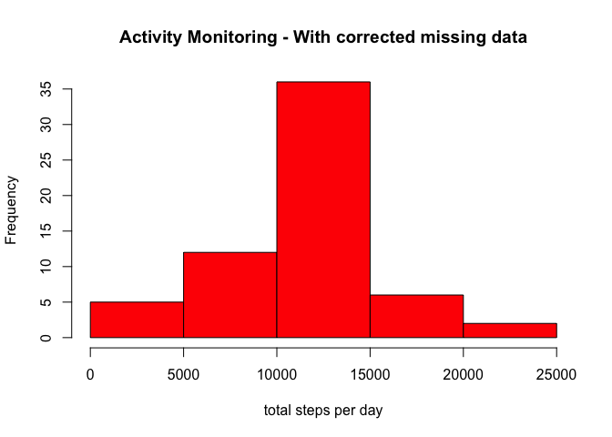

# Reproducible Research: Peer Assessment 1


## Loading and preprocessing the data

```r
# Clean up workspace
rm(list=ls())

if (!require("ggplot2")) {
  install.packages("ggplot2", repos="http://cran.rstudio.com/") 
  library("ggplot2")
}
```

```
## Loading required package: ggplot2
```

```r
# read data file
unzip('activity.zip')
dataset<-read.csv('activity.csv', header=TRUE, sep=",",na.strings="NA")
```


## What is mean total number of steps taken per day?

```r
stepsPerDay<-aggregate(steps~date, dataset, FUN=sum)

#create plot
hist(stepsPerDay$steps,
     col="red", 
     main="Activity Monitoring", 
     xlab="total steps per day")
```

 

```r
#2. Calculate and report the mean and median total number of steps taken per day

meanPerDay<-mean(stepsPerDay$steps,na.rm=TRUE)
medianPerDay<-median(stepsPerDay$steps,na.rm=TRUE)
meanPerDay
```

```
## [1] 10766.19
```

```r
medianPerDay
```

```
## [1] 10765
```
Note: I assumed that NA days should be removed.  If they were included, the mean and median would be lower, since that would be more days without steps.


## What is the average daily activity pattern?

```r
#1. Make a time series plot (i.e. type = "l") of the 5-minute interval (x-axis) and the average number of steps taken, averaged across all days (y-axis)

#get the ave steps across each 5 min interval
avestepsPerInterval<-aggregate(steps~interval, dataset, FUN=mean)

#create plot
plot(avestepsPerInterval$interval,avestepsPerInterval$steps, 
     main="Ave steps per 5 min interval",
     ylab="Ave steps", 
     xlab="5 min intervals",
     type='l')
```

 

```r
#2. Which 5-minute interval, on average across all the days in the dataset, contains the maximum number of steps?

#get the max 5 min interval
maxSteps<-max(avestepsPerInterval$steps)[1]
maxInterval<-subset(avestepsPerInterval,steps==maxSteps)[1,"interval"]
maxSteps
```

```
## [1] 206.1698
```

```r
maxInterval
```

```
## [1] 835
```


## Imputing missing values

```r
#1. Calculate and report the total number of missing values in the dataset (i.e. the total number of rows with NAs)

# From summary(dataset), you can that only "steps" has missing values
naRows<-sum(is.na(dataset$steps))
naRows
```

```
## [1] 2304
```

```r
#2. Devise a strategy for filling in all of the missing values in the dataset. The strategy does not need to be sophisticated. For example, you could use the mean/median for that day, or the mean for that 5-minute interval, etc.

##########################################################################################
##########################################################################################
# STRATEGY - replace the missing values with the 5 minute interval means - for the appropriate interval
##########################################################################################
##########################################################################################

datasetWithNAs<-subset(dataset,is.na(dataset$steps))
datasetWithoutNAs<-subset(dataset,!(is.na(dataset$steps)))

#3. Create a new dataset that is equal to the original dataset but with the missing data filled in.

# create a dataset with the missing data corrected, using the mean per interval
correctedDataset<-merge(avestepsPerInterval,datasetWithNAs,by.x="interval",by.y="interval")
correctedDataset$steps.y<-NULL
names(correctedDataset)[2]<-"steps"

#create a new dataset with the corrected data and the non-na data 
new<-merge(datasetWithoutNAs,correctedDataset, all=TRUE, sort=TRUE)

#4. Make a histogram of the total number of steps taken each day and Calculate and report the mean and median total number of steps taken per day. Do these values differ from the estimates from the first part of the assignment? What is the impact of imputing missing data on the estimates of the total daily number of steps?
stepsPerDay<-aggregate(steps~date, new, FUN=sum)

#create plot
hist(stepsPerDay$steps,
     col="red", 
     main="Activity Monitoring - With corrected missing data", 
     xlab="total steps per day")
```

 

```r
meanPerDay<-mean(stepsPerDay$steps,na.rm=TRUE)
medianPerDay<-median(stepsPerDay$steps,na.rm=TRUE)
meanPerDay
```

```
## [1] 10766.19
```

```r
medianPerDay
```

```
## [1] 10766.19
```

```r
##########################################################################################
##########################################################################################
#Summary
##########################################################################################
##########################################################################################
# - Since we added more data in place of the missing, the frequencies are slightly higher (more data).
# - The mean and median, however, are the same, since the missing data was replaced with average values per interval.
#
```


## Are there differences in activity patterns between weekdays and weekends?

```r
#1. Create a new factor variable in the dataset with two levels -- "weekday" and "weekend" indicating whether a given date is a weekday or weekend day.
new$dayFactor<-ifelse(weekdays(as.Date(new$date))=="Saturday" | weekdays(as.Date(new$date))=="Sunday","weekend","weekday")

#2. Make a panel plot containing a time series plot (i.e. type = "l") of the 5-minute interval (x-axis) and the average number of steps taken, averaged across all weekday days or weekend days (y-axis). The plot should look something like the following, which was created using simulated data:

#get the ave steps across each 5 min interval
avestepsPerInterval<-aggregate(steps~interval+dayFactor, new, FUN=mean)

library(ggplot2)
qplot(interval,steps, data=avestepsPerInterval, geom="line", ylab="Ave number of steps", xlab="5 minute intervals")+ facet_wrap(~ dayFactor, ncol = 1) 
```

 

```r
##########################################################################################
##########################################################################################
#Summary of activity patterns
##########################################################################################
##########################################################################################
# - People are up earier on the weekdays, and sleep in on the weekends
# - People are also more consistently active on the weekends, with the exception of the start of the weekday workday.
# - People are more active at night during the weekends, when they dont have to get up early for work.
```

